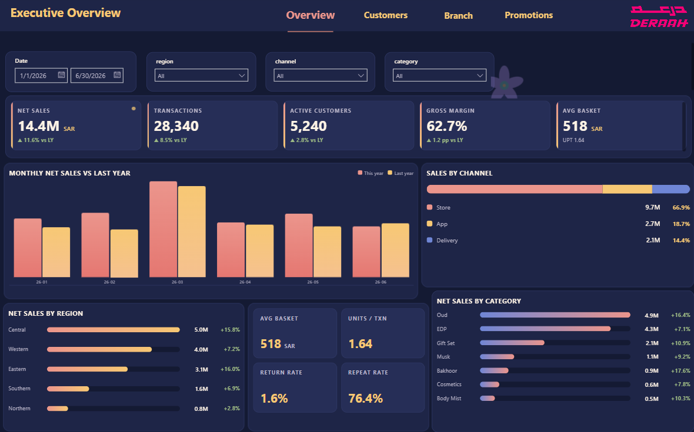
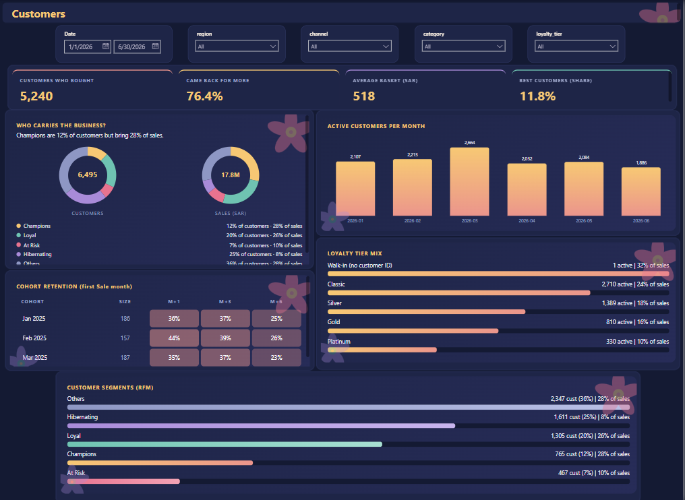
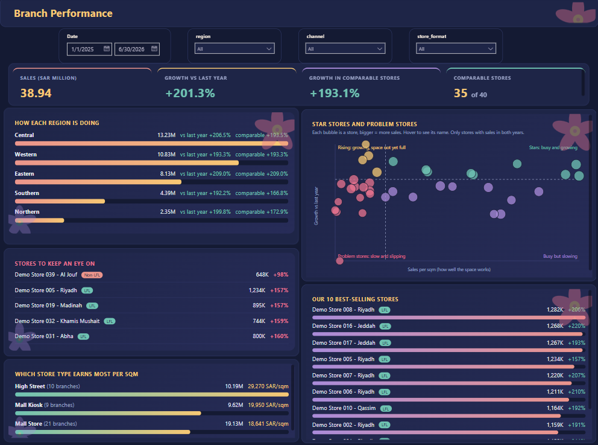
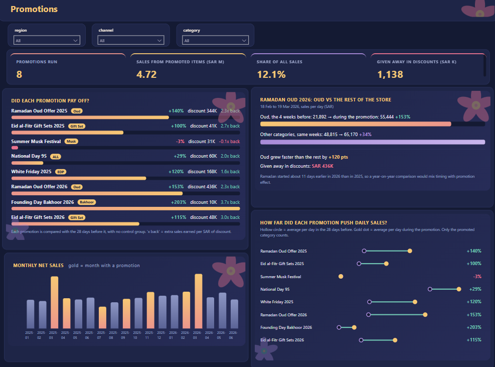

# Deraah Retail Group: Sales and Customer Analytics

An end-to-end analytics project built on 18 months of retail data (1 Jan 2025 to 30 Jun 2026) from 40 branches. It goes from raw CSV files to a SQL Server warehouse and then to a four-page Power BI dashboard. All amounts are in SAR, VAT excluded.


---

## What the project answers

- How are sales doing, and how much of the growth is real once new stores are taken out?
- Which customers drive the revenue, and do new customers come back?
- Which branches are strong, and which ones need attention?
- Do promotions lift sales, or do they just discount sales that would have happened anyway?

## Headline results (H1 2026)

| Metric | Value |
|---|---|
| Net sales | about 14.4M SAR |
| Growth vs last year | about +11.5% |
| Growth in comparable stores | about +5.9% |
| Gross margin | 62.7% |
| Average basket / UPT | 518 SAR / 1.64 |
| Champions (RFM) | 12% of customers, 28% of sales |
| P07 Oud promotion | about +154% vs about +34% for other categories |

Comparable stores are branches that opened on or before 1 Jan 2025 and were still open on 30 Jun 2026. That is 35 of the 40 branches. The Oud lift is probably overstated, because Ramadan moved by about 11 days between the two years.

---

## Dashboard


**Executive**: the big picture, with sales, growth, margin and basket.
---


---
**Customers**: RFM segments, loyalty tiers and a cohort heatmap.


---
**Branch Performance**: regions, the top 10 stores, a watch list and a drill-down from region to city to branch.
---

---
**Promotions**: cost, uplift and the P07 spotlight.



---

## Architecture

```
data/ (CSV)
   |
   v
stg   raw tables, loaded as-is
   |
   v
int   clean views, one visible rule per fix
   |
   v
marts star schema for reporting
   |
   v
Power BI dashboard
```

Database: SQL Server Express, `Deraah_SDA`.

## Repository structure

| File | What it does |
|---|---|
| `data/` | Source CSV files |
| `Load_Data.sql` | Loads the CSVs into the `stg` schema |
| `Data_Profiling.sql` | Profiles the raw data: nulls, duplicates, ranges, orphans |
| `Data_Quality_Logs.xlsx` | The data quality log (11 issues, with the decision made for each) |
| `Impact of Unresolved Data Quality Issues.xlsx` | What each issue would do to the numbers if left unfixed |
| `Data_cleaning.sql` | The cleaning rules, written as `int` views |
| `Data_Modeling.sql` | Star schema design (facts and dimensions) |
| `Data_Marts.sql` | Creates the `marts` tables |
| `Populate_Datamarts.sql` | Fills the marts from the clean views |
| `index.sql` | Indexes for the reporting queries |
| `Customer Analytics.sql` | Customer queries: repeat rate, RFM, cohorts |
| `Retail & Promotion Analysis.sql` | Sales, branch and promotion queries |
| `Deraah_DAX_Measures.dax` | Every DAX measure, with short comments |
| `Deraah_Customer_Analytics_Dashboard` | The Power BI report |
| `Assets/` | Dashboard screenshots used in this README |

## Data cleaning

I logged 11 data quality issues. The main fixes:

- Removed the test branch **B999** and all of its lines.
- Merged duplicate customers by lowercased email and kept the earliest `join_date`.
- Removed duplicate `txn_id` rows.
- Dropped transactions dated after the 30 Jun 2026 reporting date.
- Dropped lines whose SKU does not exist in the product table.
- Used `ABS()` on discounts, which were stored with mixed signs.
- Recomputed `net_amount` and fixed `is_return` where the quantity was negative.

The same rules are applied in Power Query, so the dashboard matches the SQL.

## Data model

Star schema, with the transaction lines in the centre.

- **Facts:** `Fact_transactions` (one row per receipt) and `Fact_transaction_lines` (one row per item sold).
- **Dimensions:** `Dim_branches`, `Dim_customers`, `dim_products`, `Dim_promotions`, `DimDate`.
- **Support tables:** `RFM`, `CohortOffset` and `_Measures`.

`DimDate` is marked as the date table and relates to `Fact_transactions[TxnDate]`.

## Measures

The 12 core measures are Net Sales, Net Sales LY, YoY %, Average Basket, UPT, Gross Margin %, Active Customers, Repeat Rate %, LFL Net Sales, LFL Growth %, Transactions and Return Rate %. They are all in `Deraah_DAX_Measures.dax`.

Some things I ran into:

- `DISTINCTCOUNT` counts a blank as a customer, so Active Customers uses `NOT ISBLANK`.
- `promo_id` is an empty string, not a real blank, so the promo measures test `<> ""`.
- `Rows` is a reserved word in DAX, so I used `Rws` for the variable.
- The HTML visual needs fixed pixel heights. Percentage heights do not work.

## Security

Row-level security is set up with a **Region Manager** role, filtered on `Dim_branches[region] = "Central"`. A user in that role sees only their own region.


## How to run

1. Put the CSV files in `data/`.
2. Create the database `Deraah_SDA` in SQL Server.
3. Run the scripts in this order: `Load_Data.sql`, `Data_Profiling.sql`, `Data_cleaning.sql`, `Data_Modeling.sql`, `Data_Marts.sql`, `Populate_Datamarts.sql`, `index.sql`.
4. Run `Customer Analytics.sql` and `Retail & Promotion Analysis.sql` for the analysis queries.
5. Open the Power BI report, point the source to your server and refresh. Install the **HTML Content** visual if Power BI asks for it.


## Tools

SQL Server (T-SQL), Power BI (DAX, Power Query, SVG/HTML cards), dbt-style tests, Python for checking the numbers.
